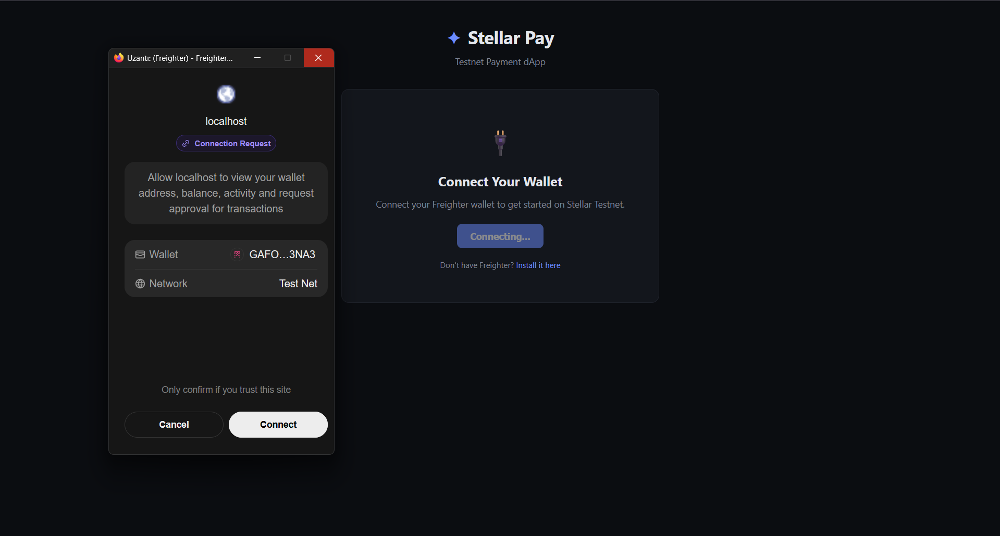
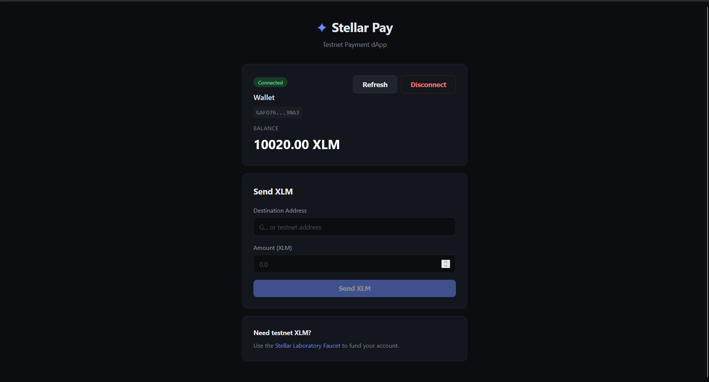
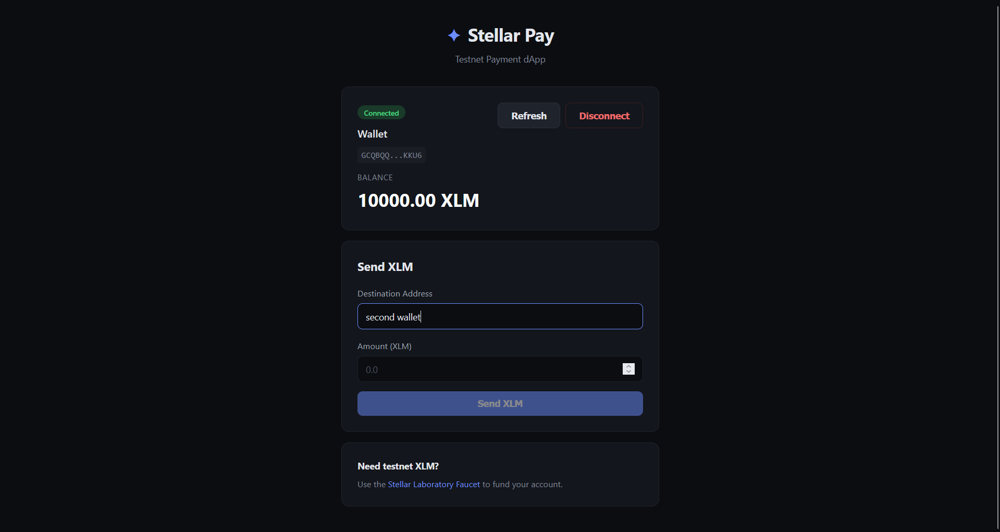
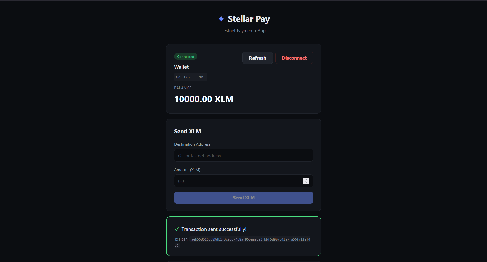

# Stellar Pay - Testnet Payment dApp

A simple Stellar payment dApp built for **Level 1 – White Belt** challenge. Connects to Freighter wallet on Stellar Testnet, displays XLM balance, and sends XLM transactions.

## Features

- Wallet connect / disconnect via Freighter
- Fetch and display XLM balance
- Send XLM transactions on Stellar Testnet
- Transaction feedback: success/failure state with transaction hash

## Setup Instructions

### Prerequisites

- [Freighter Wallet](https://freighter.app) browser extension installed
- Node.js 18+ and npm

### Run locally

```bash
git clone https://github.com/alperendgn14/stellar-payment-dapp.git
cd stellar-payment-dapp
npm install
npm run dev
```

Open the URL shown in your terminal (usually `http://localhost:5173`).

### Testnet setup

1. Install the [Freighter](https://freighter.app) extension
2. Open Freighter → Settings → Network → switch to **Testnet**
3. Fund your account using the [Stellar Laboratory Faucet](https://laboratory.stellar.org/#account-creator?network=testnet)

## Screenshots

### Wallet connected state



### Balance displayed



### Successful testnet transaction



### Transaction result shown to user



## Tech Stack

- [Vite](https://vitejs.dev/) + [React](https://react.dev/)
- [@stellar/stellar-sdk](https://github.com/stellar/js-stellar-sdk)
- [@stellar/freighter-api](https://github.com/stellar/freighter)

## Level 1 Requirements

| Requirement | Status |
|-------------|--------|
| Freighter wallet setup (Testnet) | ✅ |
| Wallet connect / disconnect | ✅ |
| XLM balance fetch and display | ✅ |
| Send XLM transaction | ✅ |
| Transaction feedback (success/failure, hash) | ✅ |
